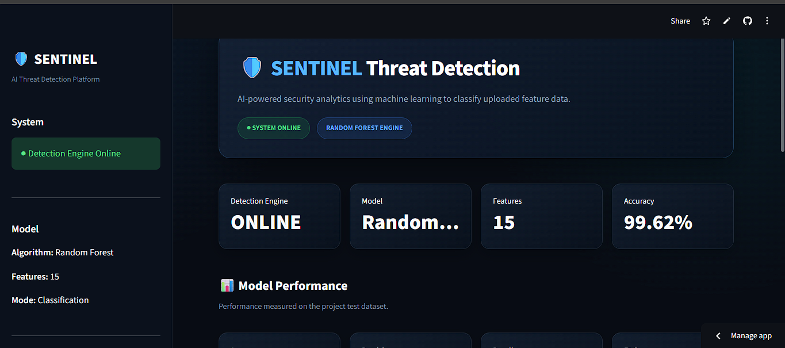
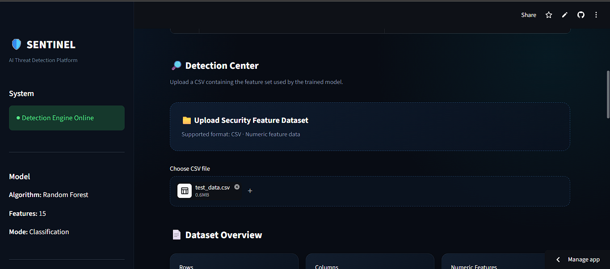
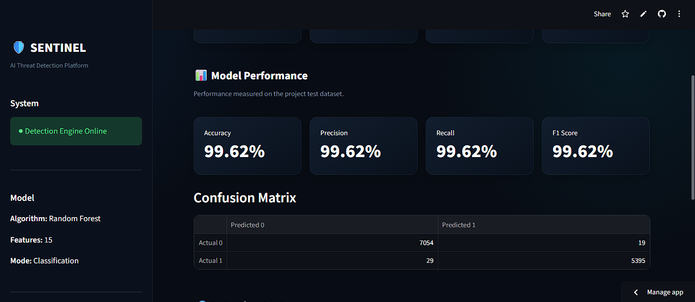

# 🛡️ SENTINEL
## AI-Based Ransomware Detection Using Machine Learning

SENTINEL is a machine-learning-based cybersecurity prototype designed to classify security-related samples as **Benign** or **Malicious** using extracted features and a trained **Random Forest classifier**.

The project combines data preprocessing, feature selection, machine learning, model evaluation, and a **Streamlit-based web interface** to provide an accessible threat-detection workflow.

> **Note:** The current implementation classifies samples according to the labels available in the dataset. The model should not be interpreted as detecting every ransomware family or as a production-ready antivirus system.

---

## 📌 Project Overview

Traditional signature-based security systems can struggle with previously unseen or modified malicious software.

SENTINEL explores a machine-learning approach where extracted features are processed and supplied to a classification model. Instead of relying only on predefined signatures, the system learns patterns from labelled training data.

The project implements the following workflow:

```text
Dataset
   ↓
Data Inspection
   ↓
Data Preprocessing
   ↓
Feature Selection
   ↓
Train/Test Split
   ↓
Random Forest Training
   ↓
Model Evaluation
   ↓
Saved Machine Learning Model
   ↓
Streamlit Application
   ↓
Threat Classification
🎯 Objectives

The main objectives of the project are:

Build a machine-learning-based threat classification system.
Preprocess and analyse security-related feature data.
Select relevant numerical features for model training.
Train a Random Forest classification model.
Evaluate the model using standard classification metrics.
Save the trained model for later prediction.
Develop a user-friendly Streamlit interface.
Provide prediction results and confidence information.
Visualize model performance and feature importance.
✨ Key Features
🧠 Machine Learning
Random Forest classifier
Feature-based classification
Automated prediction
Model persistence using Joblib
📊 Data Processing
Dataset inspection
Missing-value analysis
Duplicate checking
Numerical feature selection
Train/test splitting
Feature-order validation
📈 Model Evaluation

The project evaluates the classifier using:

Accuracy
Precision
Recall
F1-score
Confusion Matrix
Classification Report
🖥️ Streamlit Dashboard

The SENTINEL interface provides:

Security-themed dashboard
Dataset upload
Sample analysis
Benign/Malicious classification
Prediction confidence
Model performance information
Confusion matrix
Feature importance
Downloadable prediction report
🏗️ System Architecture
                    ┌──────────────────────┐
                    │       Dataset        │
                    └──────────┬───────────┘
                               │
                               ▼
                    ┌──────────────────────┐
                    │   Data Inspection    │
                    └──────────┬───────────┘
                               │
                               ▼
                    ┌──────────────────────┐
                    │   Preprocessing      │
                    └──────────┬───────────┘
                               │
                               ▼
                    ┌──────────────────────┐
                    │ Feature Selection    │
                    └──────────┬───────────┘
                               │
                               ▼
                    ┌──────────────────────┐
                    │   Random Forest      │
                    │      Training        │
                    └──────────┬───────────┘
                               │
                               ▼
                    ┌──────────────────────┐
                    │   Model Evaluation   │
                    └──────────┬───────────┘
                               │
                               ▼
                    ┌──────────────────────┐
                    │   Saved Model        │
                    └──────────┬───────────┘
                               │
                               ▼
                    ┌──────────────────────┐
                    │   Streamlit App      │
                    └──────────┬───────────┘
                               │
                               ▼
                    ┌──────────────────────┐
                    │ Threat Classification│
                    └──────────────────────┘
🤖 Machine Learning Model
Random Forest Classifier

SENTINEL uses a Random Forest Classifier as its primary machine-learning model.

Random Forest is an ensemble learning algorithm that combines multiple decision trees to produce a classification result.

Conceptually:

Training Dataset
       │
       ├── Decision Tree 1
       ├── Decision Tree 2
       ├── Decision Tree 3
       ├── Decision Tree 4
       ├── ...
       └── Decision Tree N
                │
                ▼
        Combined Prediction
                │
                ▼
        Benign / Malicious

Using multiple decision trees allows the model to learn different patterns within the feature data.

📊 Model Evaluation

The trained model was evaluated using a held-out test dataset.

The evaluation includes:

Metric	Purpose
Accuracy	Measures overall classification correctness
Precision	Measures correctness of positive predictions
Recall	Measures how many actual positive samples were detected
F1-score	Combines precision and recall
Confusion Matrix	Shows correct and incorrect classifications

The current evaluation produced the following confusion matrix:

[[7054   19]
 [  29 5395]]

The resulting test-set accuracy is approximately:

99.64%

These results apply to the evaluated dataset and should not be interpreted as real-world ransomware detection accuracy.

Detailed evaluation results are available in:

reports/results/metrics.json
reports/results/evaluation_results.txt
📁 Project Structure
AI-Ransomware-Detection/
│
├── app.py
├── README.md
├── requirements.txt
├── .gitignore
│
├── dataset/
│   ├── raw/
│   └── processed/
│
├── models/
│   ├── ransomware_model.pkl
│   └── feature_names.json
│
├── notebooks/
│
├── reports/
│   ├── figures/
│   │   └── confusion_matrix.png
│   │
│   └── results/
│       ├── evaluation_results.txt
│       └── metrics.json
│
└── src/
    ├── data_inspection.py
    ├── preprocessing.py
    ├── train.py
    ├── evaluate.py
    └── predict.py
🛠️ Technologies Used
Programming Language
Python 3
Machine Learning
Scikit-learn
Random Forest
Data Processing
Pandas
NumPy
Visualization
Matplotlib
Seaborn
Model Persistence
Joblib
Web Application
Streamlit
Development Environment
Visual Studio Code
Git
GitHub
⚙️ Installation
1. Clone the repository
git clone https://github.com/roopakjs/AI-Ransomware-Detection.git

Move into the project directory:

cd AI-Ransomware-Detection
2. Create a virtual environment
Windows
python -m venv .venv

Activate it:

.venv\Scripts\activate
3. Install dependencies
pip install -r requirements.txt
▶️ Running the Application

Start the Streamlit application:

streamlit run app.py

The application will open in your browser.

Typically:

http://localhost:8501
🔍 Using SENTINEL
Step 1

Launch the Streamlit application.

Step 2

Upload a CSV file containing the required security features.

Step 3

SENTINEL validates the available features and arranges them according to the feature structure used during model training.

Step 4

The trained Random Forest model generates predictions.

Step 5

The dashboard displays:

Total analysed samples
Benign predictions
Malicious predictions
Prediction confidence
Classification results
Feature importance
Model evaluation information
-----------------------------------------------------------------------------------------------------

📂 Dataset
-----------

The dataset used during development contains extracted features with labelled samples.

The raw and processed dataset files are not included in this GitHub repository.

This is intentional to avoid unnecessarily distributing large dataset files and to keep the repository focused on the implementation.

Before running predictions with your own data, ensure that the CSV contains the features expected by the trained model.

The expected feature structure is stored in:

models/feature_names.json
-----------------------------------------------------------------------------------------------------

🔐 Cybersecurity Scope
----------------------

This project is designed as a defensive cybersecurity and machine-learning research prototype.

It focuses on:

Threat classification
Malware-related feature analysis
Machine learning
Security analytics
Defensive detection concepts

The project does not create, modify, deploy, or execute ransomware.
-----------------------------------------------------------------------------------------------------

⚠️ Limitations
----------------

The current implementation has several limitations:

The model depends on the features and labels available in the training dataset.
Dataset quality directly affects model performance.
High test-set accuracy does not guarantee equivalent performance on unseen real-world samples.
The current implementation is a classification prototype rather than a complete endpoint security product.
The current dataset labels should be considered when interpreting whether the system is specifically ransomware detection or broader malicious-sample classification.
The system does not automatically execute suspicious files for behavioural analysis.
-----------------------------------------------------------------------------------------------------
🚀 Future Scope
-------------------

Potential future improvements include:

Larger and more diverse datasets
Automated feature extraction from safe static analysis
Behavioural feature collection
Real-time monitoring
Additional machine-learning models
Model comparison and optimization
Explainable AI techniques
Improved ransomware-family classification
Continuous model evaluation
Integration with defensive security monitoring systems

Any future behavioural analysis should be implemented in a controlled and isolated research environment.
----------------------------------------------------------------------------------------------------

📚 Project Purpose
-------------------
This project was developed as an academic cybersecurity and machine-learning project to explore how machine-learning techniques can be applied to malicious-sample classification.

The project demonstrates the complete machine-learning workflow:

Data
 ↓
Preprocessing
 ↓
Feature Engineering
 ↓
Model Training
 ↓
Evaluation
 ↓
Prediction
 ↓
Web Application
-----------------------------------------------------------------------------------------------------

👨‍💻 Author
----------
Roopak J.S.

B.Tech Computer Science and Engineering

APJ Abdul Kalam Technological University

📜 Disclaimer
--------------

SENTINEL is an academic research and demonstration project.

The predictions generated by this system should not be treated as definitive security decisions. Model performance depends on the dataset, feature representation, and operating conditions.

This project is intended for educational and defensive cybersecurity research purposes only.
------------------------------------------------------------------------------------------
⭐ If you find this project useful

Consider giving the repository a star on GitHub.
----------------------------------------------------------------------------------------------------
---

# 🖥️ Application Screenshots

## SENTINEL Dashboard



## Threat Detection Results



## Model Performance



---

# 🚀 Live Demo

[Launch SENTINEL](https://sentinel-threat-detection.streamlit.app/)